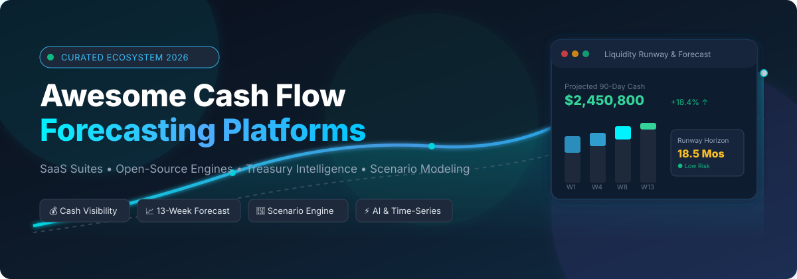
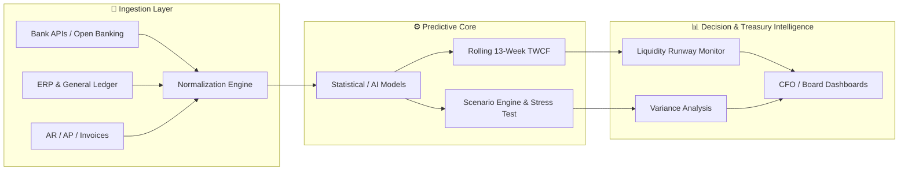

# 💰 Awesome Cash Flow Forecasting Platform 📊

**A Curated Index of SaaS Platforms & Open-Source Projects for Cash Flow Forecasting, Liquidity Planning, Treasury Intelligence & Financial Modeling.**

  
  
  
  
  
  
  
  

---

  <b>Keywords &amp; SEO Topics:</b> <i>Cash Flow Forecasting, Direct &amp; Indirect Cash Forecasting, 13-Week Cash Flow (TWCF), Treasury Management Systems (TMS), Liquidity Planning, Working Capital Optimization, Financial Planning &amp; Analysis (FP&amp;A), AI Time-Series Forecasting, Open Source ERP &amp; Double-Entry Accounting.</i>

---

## 📖 Overview

Cash Flow Forecasting platforms enable corporate finance, treasury, FP&A teams, and CFOs to aggregate bank accounts, accounting data (GL), accounts receivable (AR), accounts payable (AP), payroll, and debt schedules. These tools predict future liquidity positions, identify runway bottlenecks, simulate stress-test scenarios, and automate working-capital intelligence.

Whether you require an enterprise-grade hosted SaaS solution or a self-hosted open-source framework, this directory provides a comprehensive, unbiased benchmark.

---

## 📑 Table of Contents

- [🏢 SaaS/Hosted Platforms](#-saashosted-platforms)
- [💻 Open-Source GitHub Projects](#-open-source-github-projects)
- [🧩 Key Functional Architecture &amp; Capabilities](#-key-functional-architecture--capabilities)
- [🤝 How to Contribute](#-how-to-contribute)
- [📈 Star History](#-star-history)
- [📄 License &amp; Disclaimer](#-license--disclaimer)

---

## 🏢 SaaS/Hosted Platforms

*Ranked in descending order by company scale (valuation / annual revenue).*

| Platform | Company Scale (Valuation / Revenue) | Description | Pricing | Free Tier Limits |
| :--- | :--- | :--- | :--- | :--- |
| **[HighRadius](https://www.highradius.com/)** | **$3.1B Valuation** (~$250M+ ARR, 1,000+ enterprise clients) | Enterprise AI-powered finance and treasury platform offering cash forecasting, automated bank-statement sourcing, and AR/AP analysis. | Starts at ~$50,000/year (~$4,166/month, annual contract); outcome-based pricing options available | No free tier (0-day free trial; personalized sales demo and custom evaluation environment on request) |
| **[Fluidly](https://fluidly.com/)** | **Acquired by OakNorth Bank** ($2.8B Fintech Valuation) | Cash-flow forecasting and financial-planning platform connecting accounting data to automated forecasts (integrated into OakNorth). | Discontinued as standalone (historically started at £10/month) | Discontinued (historically provided free Basic tier limited to 1 connected accounting file with 30-day forecast) |
| **[Agicap](https://agicap.com/)** | **$500M+ Valuation** (~$105M ARR, €145M+ raised, 8,000+ corporate clients) | Cash-management and treasury platform combining multi-bank connectivity, cash-flow forecasting, liquidity planning, and bank reconciliation. | Starts at ~€250–€300/month (~€3,000/year, billed annually) | 14-day free trial (access to multi-bank sync, cash flow forecasting, and scenario planning) |
| **[Tesorio](https://www.tesorio.com/)** | **~$150M–$200M Valuation** (~$11M ARR, $35M+ Series B funding) | Cash-flow intelligence and working-capital platform combining accounts receivable, collections, payment behavior, and cash forecasting. | Starts at ~$30,000/year (~$2,500/month, annual contract) | No free tier (0-day free trial; custom proof-of-concept and demo available upon request) |
| **[Cashforce](https://www.cashforce.com/)** | **Acquired by TIS** ($100M+ Enterprise Platform) | Cash-flow forecasting and treasury-management platform focused on working-capital intelligence and liquidity forecasting (now TIS Cash Forecasting). | Starts at ~$20,000–$30,000/year (enterprise custom contract via TIS) | No free tier (0-day free trial; enterprise demo available on request through TIS) |
| **[Centime](https://www.centime.com/)** | **~$50M–$80M Valuation** (~$5M–$10M ARR) | Cash-management and forecasting platform providing rolling 13-week forecasts, configurable prediction rules, AP/AR automation, and ERP connectivity. | Starts at Interchange + 0.50% + $0.49/tx (cards) / 0.75% (max $5 for ACH); platform subscriptions start at ~$300/month | No free tier (0-day free trial; hands-on product walkthrough and pilot environment provided on request) |
| **[Fathom](https://www.fathomhq.com/)** | **Acquired by The Access Group** (£9.2B / $11B+ Group Valuation) | Financial-analysis and management-reporting platform supporting cash-flow analysis, 3-way forecasting, budgeting, and KPI reporting. | Starts at $59/month (Starter plan, 1 company) | 14-day free trial (full access to financial forecasting, reporting, and KPI tools, no credit card required) |
| **[CashAnalytics](https://www.cashanalytics.com/)** | **Acquired by GTreasury** (~$500M+ Treasury Suite / ~$3.8M ARR) | Enterprise cash forecasting and treasury platform focused on automated cash forecasting, liquidity visibility, and variance analysis. | Starts at €420/month (~$450/month, billed annually) | No free tier (0-day free trial; guided live product demo available upon request) |
| **[Futrli](https://www.futrli.com/)** | **Acquired by Sage Group plc** (£10B+ FTSE-100 Parent Company) | Financial forecasting and reporting platform that uses accounting data to produce 3-way forecasts across P&L, balance sheet, and cash flow. | Starts at $40/month (Single plan, 1–5 client/company licenses) | 14-day free trial (full access to 3-way forecasting and scenario modeling, no credit card required) |
| **[Float](https://floatapp.com/)** | **~$15M–$25M Valuation** (~$2.8M ARR, 4,000+ active businesses) | Visual cash-flow forecasting and budgeting tool directly integrating with Xero, QuickBooks Online, and FreeAgent. | Starts at $59/month (Essential plan, 1 company) | 14-day free trial (full access to real-time cash forecasting and scenario planning, no credit card required) |
| **[CashFlowTool](https://www.cashflowtool.com/)** | **~$10M–$15M Valuation** (Finagraph / Visa &amp; Moody's Partner) | Cash-flow forecasting and financial-planning platform focused on projecting cash balances, monitoring liquidity, and what-if scenario planning. | Starts at $50/month (billed annually) / $59/month (Pro plan) | Free "Lite" plan (limited to 1 user and 1 company connection); 14-day free trial for Pro tier |
| **[Joiin](https://www.joiin.co/)** | **~$5M–$10M Valuation** (~$1.5M ARR, 40,000+ entities consolidated) | Financial reporting and data-consolidation platform combining accounting data into cash-flow and multi-entity management reports. | Starts at $24/month (1 entity plan) | 14-day free trial (unlimited users, unlimited reports, and multi-currency consolidation, no credit card required) |

---

## 💻 Open-Source GitHub Projects

*Ranked in descending order by GitHub Stars ⭐.*

| Repository | GitHub Stars Badge | Category | Description |
| :--- | :---: | :--- | :--- |
| **[maybe-finance/maybe](https://github.com/maybe-finance/maybe)** |  | 💼 Personal &amp; Wealth Finance | The personal finance OS for tracking net worth, cash flow trajectories, investment accounts, and future financial planning. |
| **[odoo/odoo](https://github.com/odoo/odoo)** |  | 🏢 Enterprise ERP &amp; Accounting | Comprehensive open-source ERP with dedicated Treasury, Cash Flow Forecasting, dynamic bank reconciliation, and AR/AP aging modules. |
| **[frappe/erpnext](https://github.com/frappe/erpnext)** |  | 🏢 Enterprise ERP &amp; Accounting | 100% open-source ERP system featuring 13-week cash flow projections, liquidity analytics, budgeting, multi-currency ledger, and bank feeds. |
| **[actualbudget/actual](https://github.com/actualbudget/actual)** |  | 💳 Budget &amp; Cash Flow Manager | Fast, privacy-focused, local-first personal finance and cash planning application with bank syncing and envelope budgeting. |
| **[firefly-iii/firefly-iii](https://github.com/firefly-iii/firefly-iii)** |  | 📊 Financial Management | Self-hosted double-entry financial manager supporting recurring cash transactions, cash flow predictive charts, and rule-based automation. |
| **[facebook/prophet](https://github.com/facebook/prophet)** |  | 🔮 Time-Series Forecasting | Production-grade time-series forecasting framework designed for non-linear trends with seasonal cash-flow cycles and holiday effects. |
| **[thuml/Time-Series-Library](https://github.com/thuml/Time-Series-Library)** |  | 🤖 Deep Learning Forecasting | Advanced deep learning library for long-term time series forecasting (PatchTST, TimesNet, DLinear, iTransformer) applied to financial data. |
| **[infracost/infracost](https://github.com/infracost/infracost)** |  | ☁️ FinOps &amp; Cloud Runway | Cloud cost and cash burn forecasting for engineering infrastructure, enabling predictive monthly operational expense modeling. |
| **[sktime/sktime](https://github.com/sktime/sktime)** |  | 📈 ML Forecasting Framework | Unified Python framework for machine learning time-series forecasting, multivariate regression, and backtesting financial models. |
| **[pycaret/pycaret](https://github.com/pycaret/pycaret)** |  | ⚡ AutoML &amp; Time Series | Low-code machine learning library with end-to-end time-series forecasting pipelines for automated revenue and expense modeling. |
| **[unit8co/darts](https://github.com/unit8co/darts)** |  | 🎯 Time-Series Forecasting | User-friendly Python library for time-series forecasting and anomaly detection ranging from ARIMA to deep neural models (N-BEATS, TiDE). |
| **[ghostfolio/ghostfolio](https://github.com/ghostfolio/ghostfolio)** |  | 🛡️ Wealth &amp; Liquidity Tracking | Open-source wealth and portfolio tracker empowering individuals and SMBs to monitor cash reserves, dividend streams, and asset allocations. |
| **[killbill/killbill](https://github.com/killbill/killbill)** |  | 💳 Billing &amp; Payment Engine | Open-source subscription billing, invoicing, and payment processing platform essential for projecting recurring cash inflows. |
| **[Nixtla/statsforecast](https://github.com/Nixtla/statsforecast)** |  | ⚡ High-Speed Statistical Forecasting | Lightning-fast implementation of statistical and econometric forecasting models (AutoARIMA, ETS, CES) optimized for massive financial series. |
| **[Gnucash/gnucash](https://github.com/Gnucash/gnucash)** |  | 🧾 Accounting &amp; Ledger | Veteran double-entry accounting software featuring cash flow reporting, balance sheet reconciliations, customer/vendor tracking, and budgets. |
| **[ourownstory/neural_prophet](https://github.com/ourownstory/neural_prophet)** |  | 🧠 Neural Time Series | PyTorch-based neural time-series model combining Prophet-like interpretability with deep neural network capabilities for financial trends. |
| **[Nixtla/neuralforecast](https://github.com/Nixtla/neuralforecast)** |  | 🧠 Neural Forecasting | Scalable neural time series models (NHITS, Informer, PatchTST, TFT) with probabilistic prediction intervals for financial variance. |
| **[rotki/rotki](https://github.com/rotki/rotki)** |  | 🔒 Privacy Portfolio &amp; Cash Tracker | Self-hosted portfolio tracker and accounting tool providing multi-asset cash flow history without exposing data to third parties. |
| **[apache/ofbiz](https://github.com/apache/ofbiz)** |  | 🏛️ Enterprise ERP Framework | Java-based enterprise automation suite providing modular accounting, cash flow journals, invoice management, and treasury workflows. |
| **[kresusapp/kresus](https://github.com/kresusapp/kresus)** |  | 🏦 Self-Hosted Bank Manager | Personal and small-business banking aggregator with automated transaction categorization, balance alerts, and cash trends. |

---

## 🧩 Key Functional Architecture &amp; Capabilities

- **Direct vs. Indirect Forecasting:** Direct forecasting tracks operational cash inflows (customer payments) and outflows (vendor bills, payroll); indirect forecasting translates Net Income and Balance Sheet adjustments into Cash Flow from Operations.
- **13-Week Cash Flow (TWCF):** The gold standard for operational liquidity management, providing granular weekly visibility over a 90-day horizon.
- **What-If Scenario Simulation:** Stress-testing assumptions against delayed customer collections, inflation spikes, revenue dips, or unexpected capital expenditures.
- **Variance Tracking (Actual vs. Forecast):** Measuring forecast accuracy over time to continuously calibrate algorithmic confidence intervals.

---

## 🤝 How to Contribute

Contributions are warmly encouraged! Follow these quick steps:

1. 🍴 **Fork** the repository.
2. 🌿 **Create a branch** for your addition (`git checkout -b add-platform-name`).
3. 📝 **Add your platform or open-source tool** following the existing table formatting and criteria (include starting price, free tier limits, and accurate star badges).
4. 🚀 **Submit a Pull Request** with a concise description of why the tool belongs here.

---

## 📈 Star History

---

## 📄 License &amp; Disclaimer

- This repository is licensed under the [Creative Commons Zero v1.0 Universal (CC0-1.0)](LICENSE) Public Domain Dedication.
- *Disclaimer: Pricing, valuations, and features are gathered from public vendor disclosures, filings, and industry reports as of August 2026. For contractual terms, verify directly with respective vendors.*
